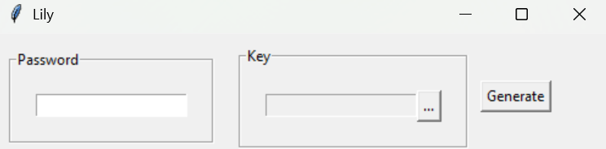

<!--
 Copyright (c) 2025 E1480
 
 This software is released under the MIT License.
 https://opensource.org/licenses/MIT
-->

# Lily Password

Lily password lets you generate a file where you can enter a password to decrypt everything inside the same folder as the app.

## there are 2 ways to use it:
1. Don't specify a key file:
   -  For this you need to put the key file in the same folder as the app.
2. Specify a key file:
   - For this you can just put the app where all your encrypted files.