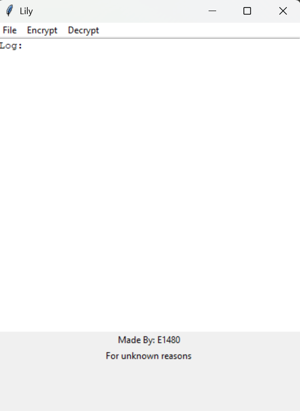

<!--
 Copyright (c) 2025 E1480
 
 This software is released under the MIT License.
 https://opensource.org/licenses/MIT
-->


<div align="center">

<h1>Lily Encryptor</h1>
</div>
an easy-to-use program that lets you encrypt and decrypt files and all files in a folder using Fernet, with a GUI made using tkinter.




Run the program by running:
```bash
python run.py
```
OR
```bash
py run.py
```

If you downloaded the release ver.
just run ``` Lily.exe ```

> [!CAUTION]
> DO NOT LOSE YOUR key FILE


> [!NOTE]
> You can't use a different key file for now

> [!NOTE]
> the key file is stored in ./util/key


### checkout **Lily Password** *(I need a better name.)*: **[Lily password](LilyPassword/)**

## TODO:
- [x] Be able to choose a different key file
- [ ] Add more settings (Depending on feedback)


